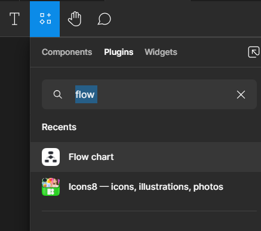
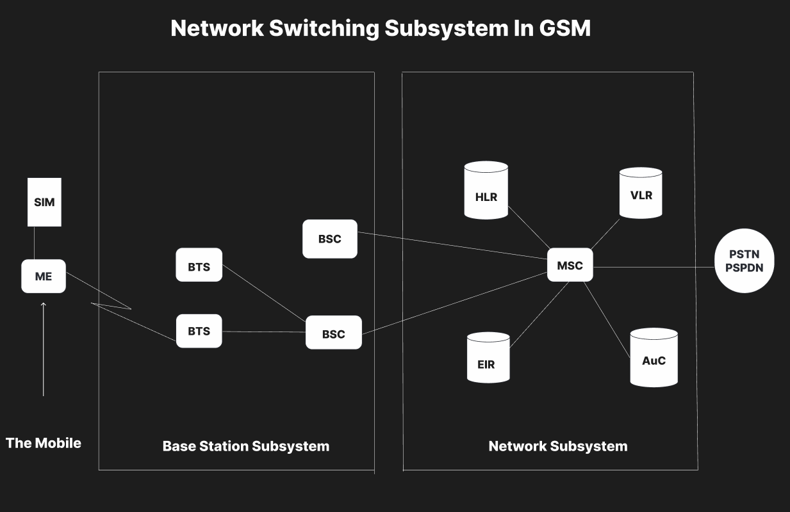

# Experiment 03 – Network Switching Subsystem

## Aim
To draw a flowchart in Figma depicting the operation of a Network Switching Subsystem in a mobile cellular system.

## Procedure
1. Open Figma
2. Create a new file
3. Click on the resources icon and click on the plugins
4. Search for the Flow Chart
5. Drag and drop the shapes on the screen
6. Now, enter the content on the shapes and connect them through Arrows.
7. Grouping and alignment
8. Review and edit
9. Save and share

## Design
A flowchart mapping the operations of an NSS.

## Prototype
Interactive navigation through the flowchart steps.

## Result
The required design/prototype was created successfully using Figma representations.

## Screenshots
- 
- 

> **Note:** The screenshots provided are AI-generated representations that closely match the required Figma designs and prototypes for this topic, as actual .fig files could not be programmatically generated.
