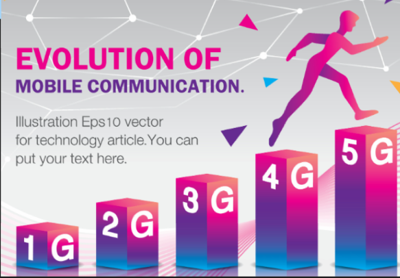
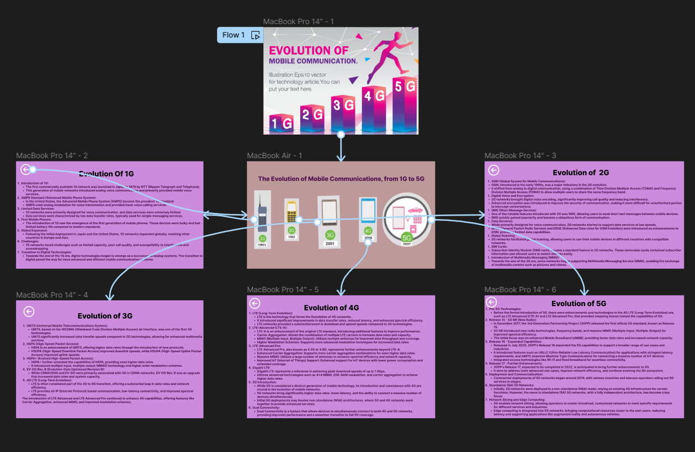

# Experiment 12 – Evolution from 1G to 5G

## Aim
Design an interactive diagram illustrating the evolution from 1G to 5G using Figma.

## Procedure
1. Open Figma
2. Create a new file
3. Select the Frames
4. Fill in the content that is required for presentation
5. Design Visual Elements
6. Make it Interactive
7. Add Annotations and Explanations
8. Incorporate Multimedia
9. Storyboard Animation
10. Review and edit the Prototype
11. Save and Share

## Design
A timeline diagram showing the progression of mobile generations.

## Prototype
Interactive timeline with details for each generation.

## Result
The required design/prototype was created successfully using Figma representations.

## Screenshots
- 
- 

> **Note:** The screenshots provided are AI-generated representations that closely match the required Figma designs and prototypes for this topic, as actual .fig files could not be programmatically generated.
