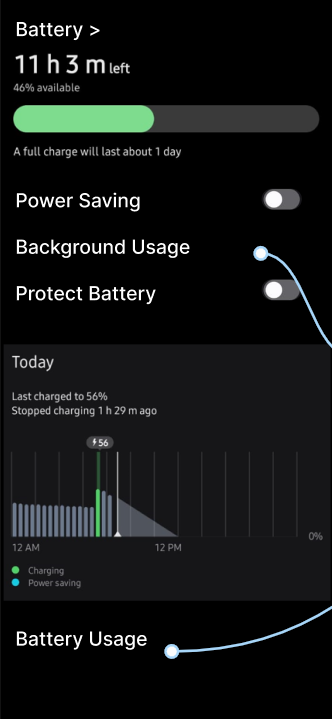
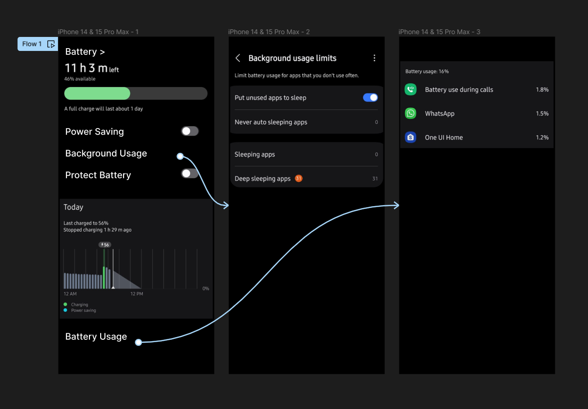

# Experiment 20 – Power-Management Approaches

## Aim
Design a wireframe in Figma for a mobile application showcasing power management approaches.

## Procedure
1. Create a file
2. Add The First Frame
3. Add Shapes
4. Add Text
5. Create The Second Frame
6. Add Prototyping

## Design
Wireframes highlighting battery and power management UI.

## Prototype
Interactive settings and power-saving toggles.

## Result
The required design/prototype was created successfully using Figma representations.

## Screenshots
- 
- 

> **Note:** The screenshots provided are AI-generated representations that closely match the required Figma designs and prototypes for this topic, as actual .fig files could not be programmatically generated.
