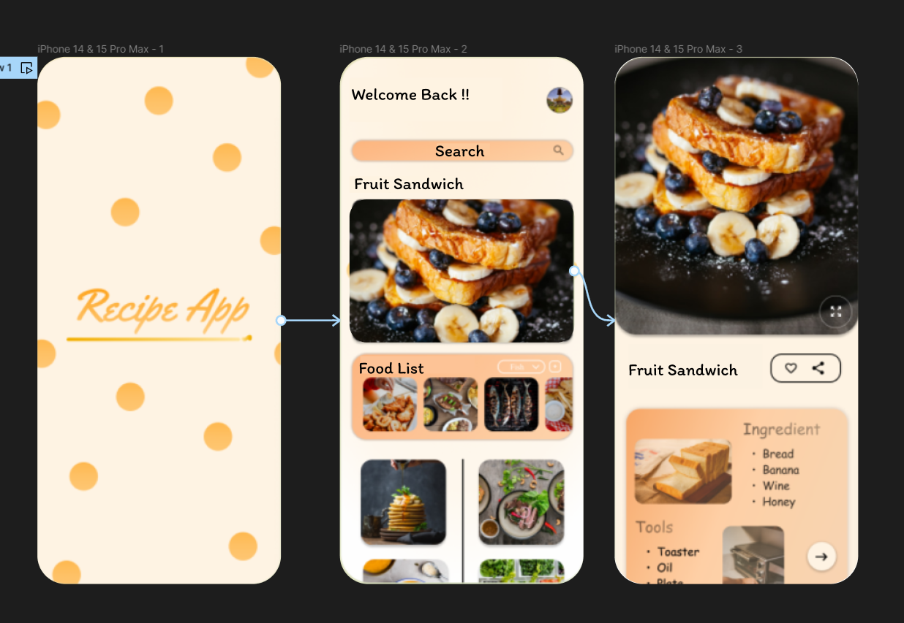

# Experiment 21 – User Connectivity and Convenience

## Aim
To design a mobile app interface that prioritizes user connectivity and convenience. Highlight key elements.

## Procedure
1. Create a file
2. Add The First Frame
3. Add Shapes
4. Add Text
5. Create The Second Frame
6. Add Prototyping

## Design
App interface tailored for seamless user connectivity.

## Prototype
Interactive usability features and quick actions.

## Result
The required design/prototype was created successfully using Figma representations.

## Screenshots
- 
- 

> **Note:** The screenshots provided are AI-generated representations that closely match the required Figma designs and prototypes for this topic, as actual .fig files could not be programmatically generated.
