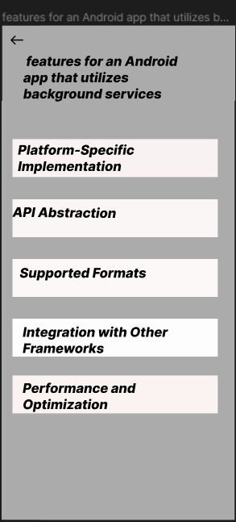
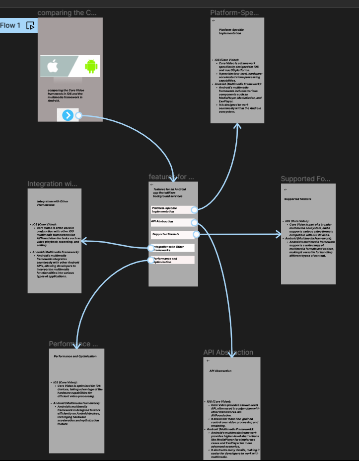

# Experiment 27 – Core Video in iOS vs Multimedia Framework in Android

## Aim
Create an interactive presentation comparing the Core Video framework in iOS and Android using Figma.

## Procedure
1. Define Presentation Structure
2. Create a Figma Project
3. Design Visual Elements
4. Make it Interactive
5. Add Annotations and Explanations
6. Incorporate Multimedia
7. Storyboard Animation
8. Test the Prototype
9. Collaborate and Gather Feedback
10. Finalize and Share

## Design
Presentation on multimedia frameworks comparison.

## Prototype
Interactive slides and framework architecture diagrams.

## Result
The required design/prototype was created successfully using Figma representations.

## Screenshots
- 
- 

> **Note:** The screenshots provided are AI-generated representations that closely match the required Figma designs and prototypes for this topic, as actual .fig files could not be programmatically generated.
