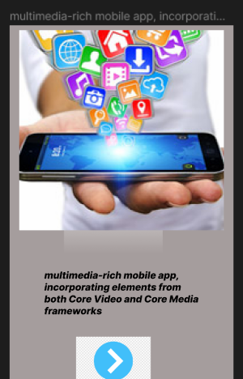
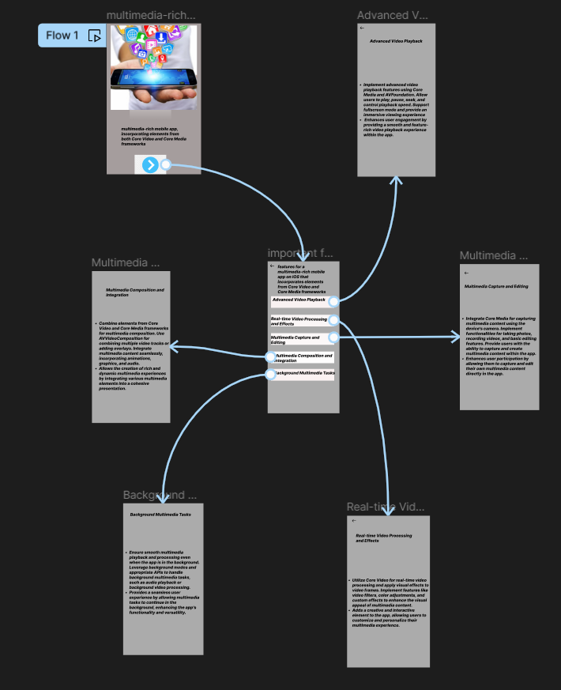

# Experiment 28 – Core Video and Core Media Concepts

## Aim
Design a wireframe for a multimedia-rich mobile app, incorporating elements from both Core Video and Core Media frameworks using figma.

## Procedure
1. Open Figma
2. Create a new file
3. Select the Frames
4. Design Visual Elements
5. Make it Interactive
6. Add icons on the Frame
7. Incorporate Multimedia
8. Storyboard Animation
9. Review and edit the Prototype
10. Save and Share

## Design
Wireframe for a video-centric mobile application.

## Prototype
Interactive video playback and media controls.

## Result
The required design/prototype was created successfully using Figma representations.

## Screenshots
- 
- 

> **Note:** The screenshots provided are AI-generated representations that closely match the required Figma designs and prototypes for this topic, as actual .fig files could not be programmatically generated.
