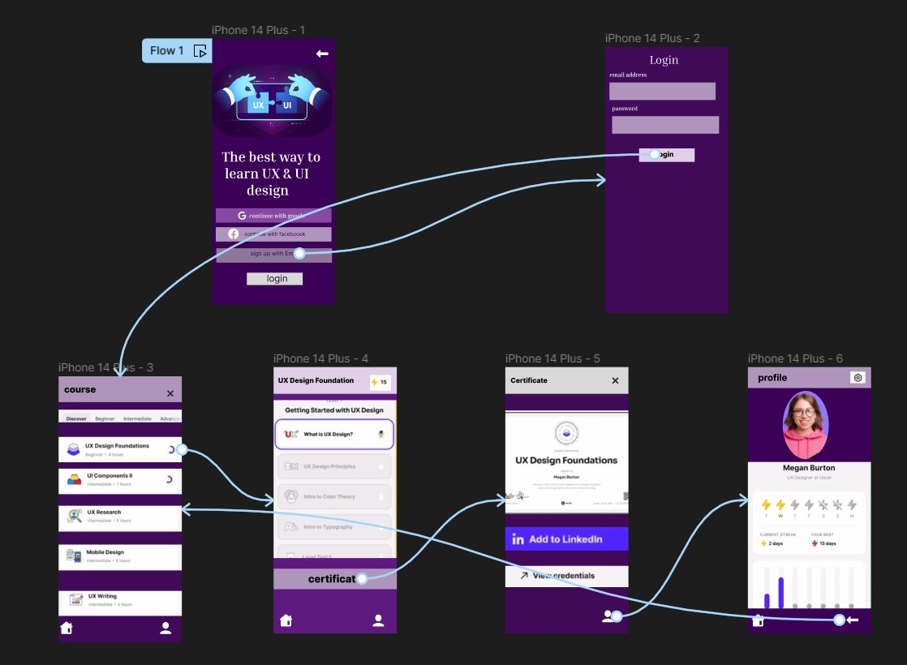

# Experiment 30 – Optimized Graphics and UI-Performance Principles

## Aim
To Develop wireframes for a visually rich mobile app with optimized graphics and UI performance, using Figma to showcase the design principles.

## Procedure
1. Open Figma
2. Create a new file
3. Select the Frames
4. Design Visual Elements
5. Make it Interactive
6. Add icons on the Frame
7. Incorporate Multimedia
8. Storyboard Animation
9. Review and edit the Prototype
10. Save and Share

## Design
Wireframes demonstrating high-performance UI rendering techniques.

## Prototype
Interactive elements showcasing smooth animations and transitions.

## Result
The required design/prototype was created successfully using Figma representations.

## Screenshots
- 
- 

> **Note:** The screenshots provided are AI-generated representations that closely match the required Figma designs and prototypes for this topic, as actual .fig files could not be programmatically generated.
